This guide goes through all the steps to stream music from an analog vinyl player (or any other RCA source) to your Sonos system, by using a Raspberry Pi.

The guide is based on this Instructable guide: https://www.instructables.com/Add-Aux-to-Sonos-Using-Raspberry-Pi/. But I've spent time simplifying the process, wrapping everything in a `docker-compose.yml` and creating a pre-built Raspberry Pi image where everything is set up using a `systemd` service. 

# Table of content
1. [Needed hardware](#needed-hardware)
2. [Overview software](#overview-software)
	1. [Darkice](#darkice)
	2. [Icecast2](#icecast2)
3. [How to stream vinyl to your Sonos speakers](#how-to-stream-vinyl-to-your-sonos-speakers)
	1. [Download the pre-built Raspberry Pi image](#download-the-pre-built-raspberry-pi-image)
	2. [Unzip the Raspberry Pi image](#unzip-the-raspberry-pi-image)
	3. [Install Raspberry Pi Installer](#install-raspberry-pi-installer)
	4. [Install the Raspberry Pi image to the SD card](#install-the-raspberry-pi-image-to-the-sd-card)
	5. [Connect vinyl player to the Raspberry Pi](#connect-vinyl-player-to-the-raspberry-pi)
	6. [Point the Sonos speakers to the vinyl stream](#point-the-sonos-speakers-to-the-vinyl-stream)

## Needed hardware
To stream the sound from a vinyl record player to the Sonos speakers, you will need:

* 1x RaspberryPi (with USB Type-A)
* 1x RaspberryPi power adapter (adjusted to the RaspberryPi you're using)
* 1x 8GB MicroSD card
* 1x SD card reader/adapter (if your computer doesn't already support it)
* 1x Behringer U-PHONE UFO202

## Overview software

### Darkice

DarkIce is a live audio streamer. It records audio from an audio interface (e.g. sound card), 
encodes it and sends it to a streaming server. This software is used to read the vinyl signals 
coming from the U-PHONE UFO202.

URL: [http://www.darkice.org](http://www.darkice.org)

### Icecast2

Icecast is a streaming media server which we will use to stream the live audio from Darkice and 
broadcast it out in our local network. This is what the Sonos speakers will pick up and play.

URL: [https://icecast.org](https://icecast.org)

## How to stream vinyl to your Sonos speakers

> **Note**
> This section uses my pre-built Raspberry Pi image. If you wish to use the default Raspberry Pi image and set up the service yourself, that is also possible. This can be done by flashing the SD card with the default RPi image, clone down this repository on the RPi, `cd` into the repo, install docker by executing `install-docker.sh` and setting up the service by running `setup-service.sh`.

### Download the pre-built Raspberry Pi image

Start by downloading the pre-built Raspberry Pi image here: [https://github.com/maxvfischer/sonos-streaming/actions/runs/13652358409/artifacts/2688349179](https://github.com/maxvfischer/sonos-streaming/actions/runs/13652358409/artifacts/2688349179). If the image has expired, [ping me in this issue](https://github.com/maxvfischer/sonos-streaming/issues/5), and I'll restart the build.

This image was built using `pi-gen`, by executing `build-pi-image.sh` inside a GitHub Action pipeline ([https://github.com/maxvfischer/sonos-streaming/actions/runs/12058015195](https://github.com/maxvfischer/sonos-streaming/actions/runs/12058015195)).

The image will automatically start the `systemd` service `sonos-streaming` on boot up, starting the streaming by executing `docker-compose.yml`. 

### Unzip the Raspberry Pi image

As both `pi-gen` and `GitHub Actions` apply compression, you will need to decompress it twice until you have the raw image file `image_2023-10-29-sonos-streaming.img`.

### Install Raspberry Pi Installer

The Raspberry Pi Installer is a software developed by the Raspberry Pi Foundation to simplify the installation of the Raspberry Pi OS to a microSD card.

Download the Raspberry Pi Installer on your computer by following the instructions on this website: [https://www.raspberrypi.com/software/](https://www.raspberrypi.com/software/)

After you've downloaded, installed and started the installer, you should see a page similar to this:

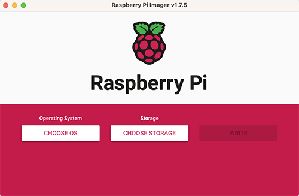

### Install the Raspberry Pi image to the SD card

Start of by inserting the microSD card you're planing to use into the computer.

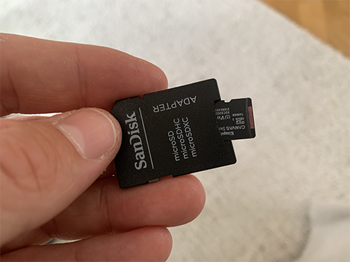

Then click on `CHOOSE OS` and choose `Use custom` at the very bottom. Look for and choose the downloaded Raspberry Pi image.

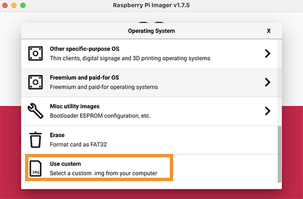

After that, click on `CHOOSE STORAGE` and choose the microSD card you just inserted.

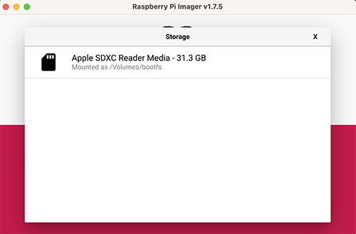

Before installing the OS, we want to change some configurations. This is done by clicking on the cogwheel in the lower right corner.

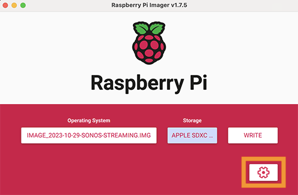

Do the following:

* Check `Enable SSH` and `Use password authentication`.
* Check `Set username and password` and choose whatever username and password you want to use to log into the Raspberry Pi.
* Check `Configure wireless LAN` and **fill in the name of the wifi your Sonos speakers are connected to, as well as the wifi password** (this is very important, if done incorrectly, the speakers won't find the music stream).

Then click `SAVE`.

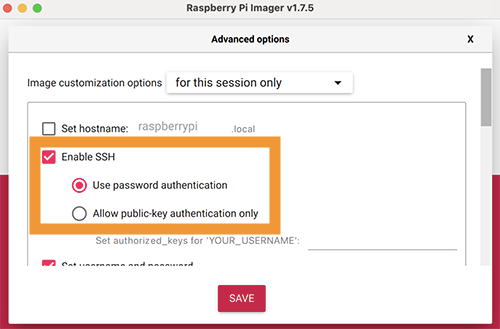

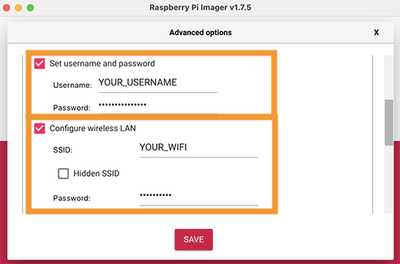

To install the OS to the microSD card, click `WRITE`. You might get prompted with a warning saying that all existing data will be erasted. If you're fine with this and want to proceed installing the OS, click `YES`.

The installation should take approx. 5-10 minutes.

When the installation is done, remove the microSD card from your computer and insert it into the Raspberry Pi.

### Connect vinyl player to the Raspberry Pi

Start of by connecting the USB from Behringer U-PHONE UFO202 to the Raspberry Pi.

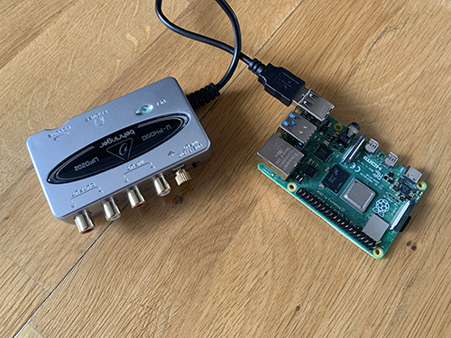

Then connect the red and white RCA cable from the vinyl player to the equivalent **input** on the Behringer U-PHONE UFO202. Red to input red, white to input white.

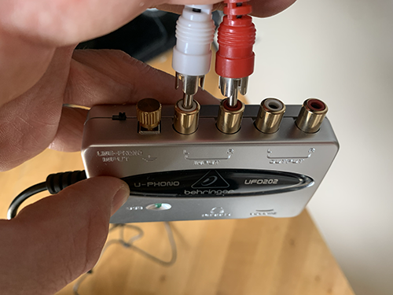

Finally, connect the power cable to the Raspberry Pi.

### Point the Sonos speakers to the vinyl stream

Make sure that you have the following apps installed on your phone:

* Sonos
* TuneIn Radio

Both can be found in the App store. Also make sure that your Sonos system is properly set up and that you can control your speakers from the Sonos app.

Sorry about the language in the upcoming images. I wasn't able to change the language in my app from German to English.

Opening the TuneIn Radio app, where you need to start off by set up a free account.

After you've created an account and logged in, click on `LIBRARY` (`BIBLIOTHEK` in the print screen).

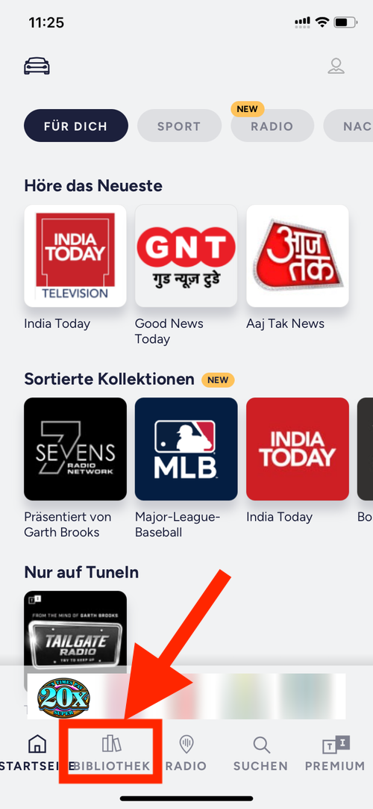

Click on `Custom URL` (`Benutzerdefinierte URL`)

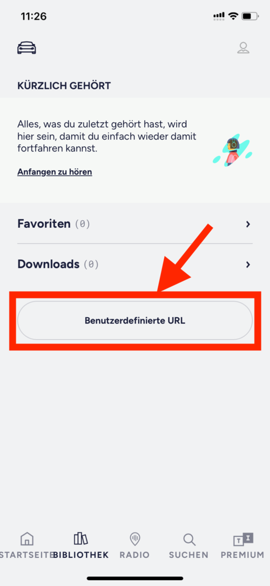

Write the custom streaming url, http://raspberrypi.local:8000/rapi.mp3, and then click on it.

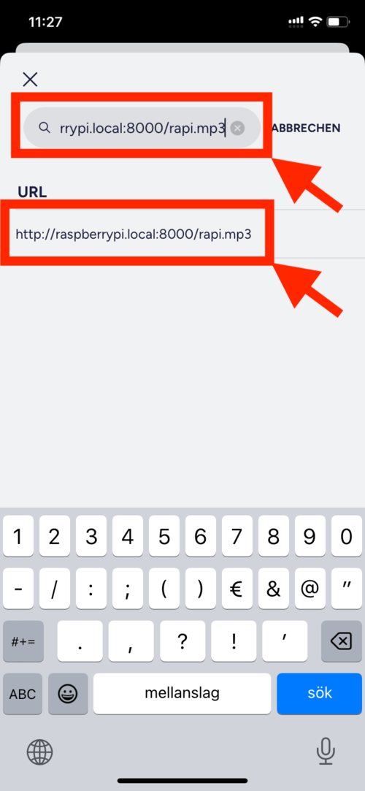

You will now see your vinal stream starting in the app. If you have a record playing on the vinyl, you should hear music streaming from the phone.

Click on the heart symbol to add it as a favorite. Write whatever name you want to give it.

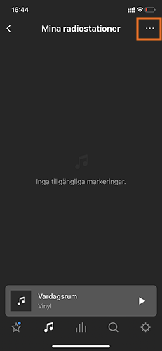

You should now see the stream visible under the `LIBRARY` tab.

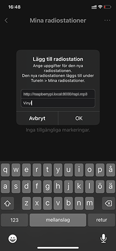

Now it's time to move to the Sonos app. Open the app and click on the plus under `Your services` (or similarly named, it's `Deine Dienste` in German).

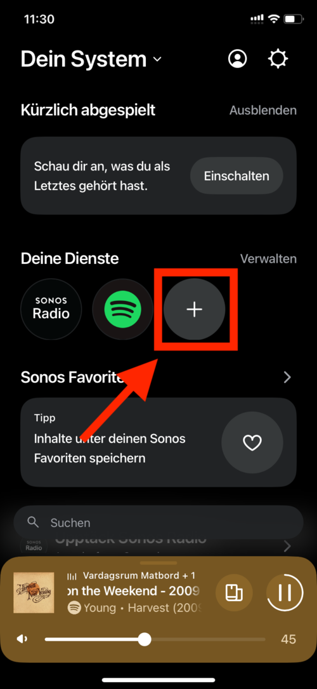

Search for `TuneIn` and click on `TuneIn (New)`.

Add `TuneIn` to your Sonos app, by clicking on `Add to sonos` (or similarly named) and then `Authorize`.

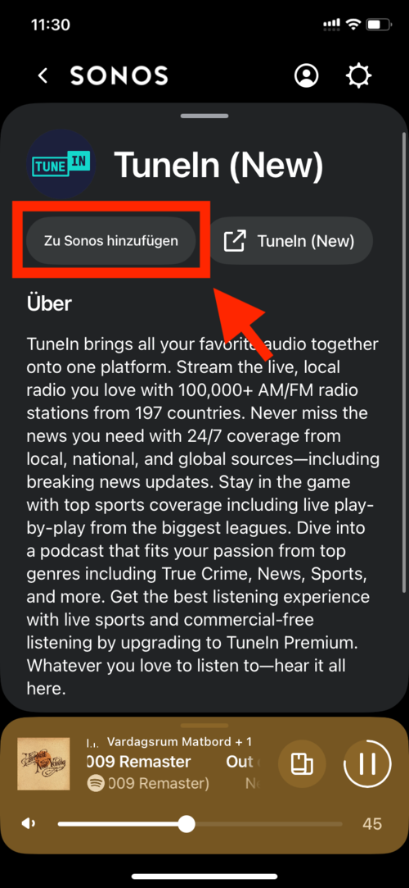

Log in with your TuneIn account.

You should now see `TuneIn` under `Your services`.

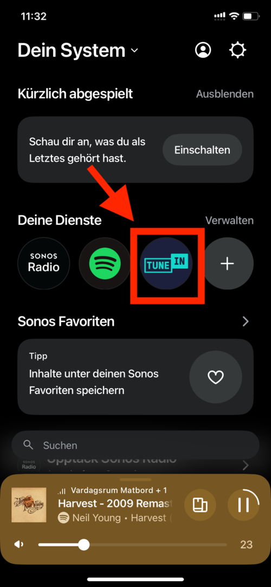

After clicking on it, you will see the previously favourited stream.

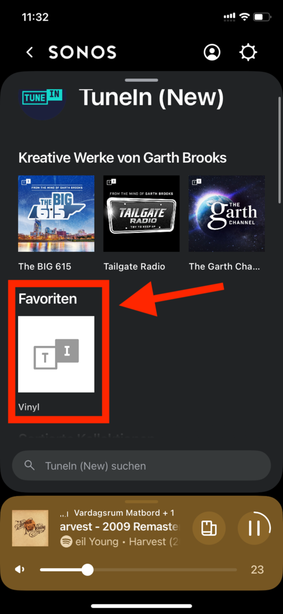

Click on it, click play and choose the Sonos speakers you want to stream to. You are now fully set up and should hear your vinyl streaming to your speakers!

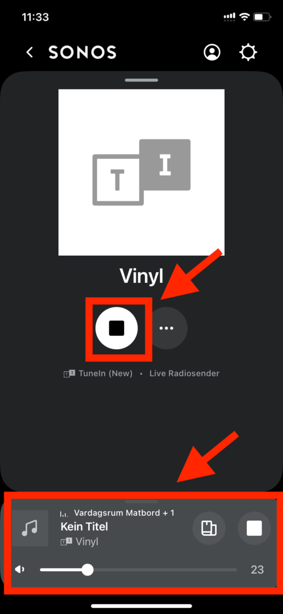
